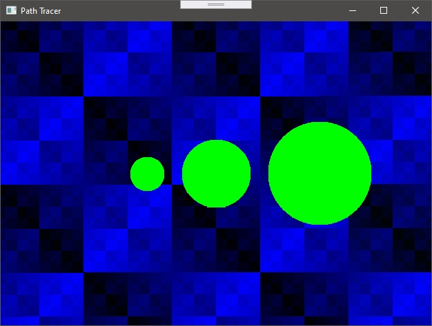
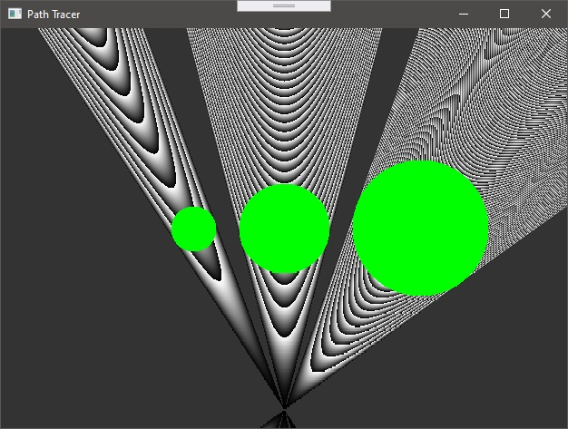
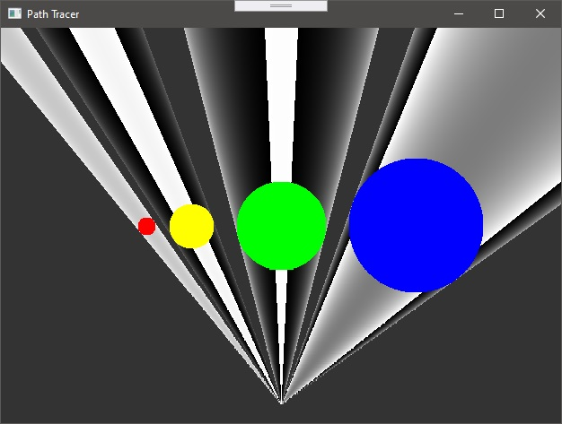
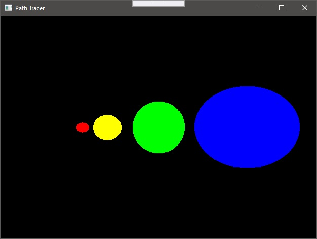
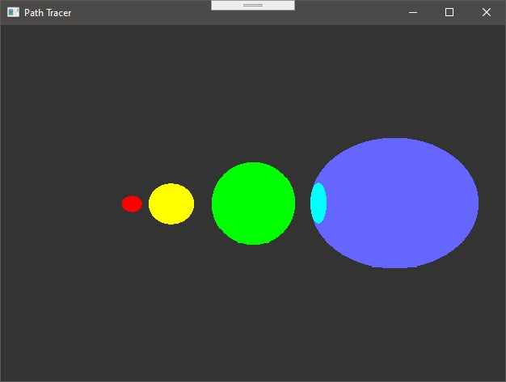
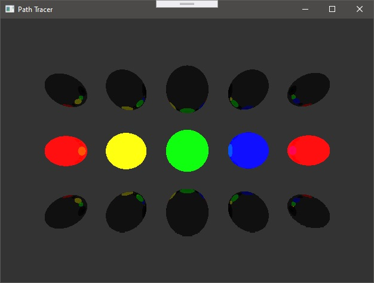
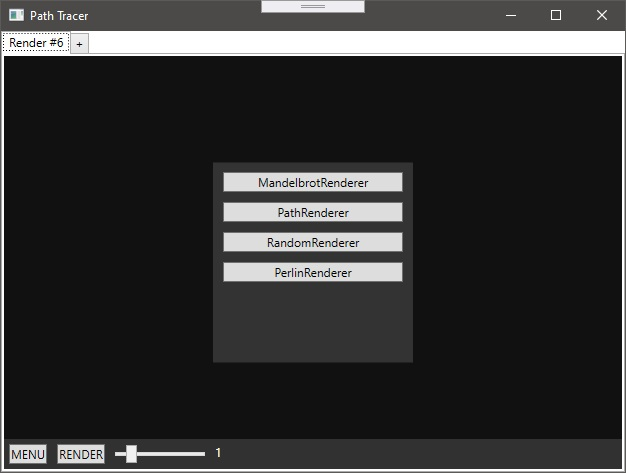
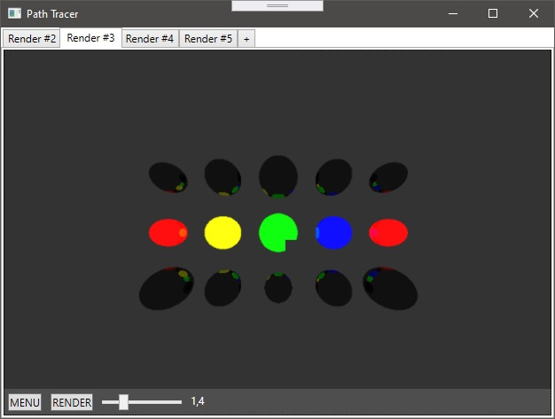
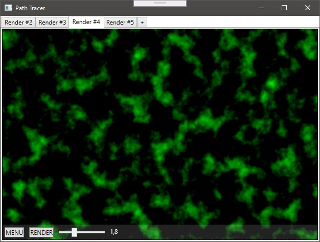
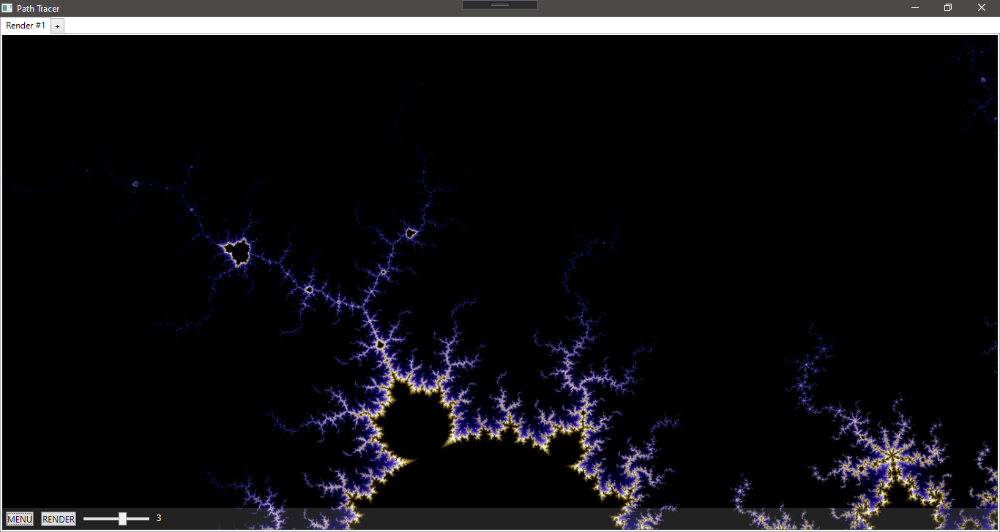

# RenderBox (ex Path Tracer Sharp)

## Introduction

Main aim of this project is implementation of path tracing algorithm in C# (without GPU optimisation at first time).

Sources:

* https://en.wikipedia.org/wiki/Path_tracing (EN)

* https://ru.wikipedia.org/wiki/Трассировка_пути (RU)

## Requirements

* Visual Studio 2019
* .NET Core SDK 5.0

## TODO

1. Basic drawing framework
2. ...

## Draft (pseudo-code)

	Color TracePath(Ray ray, count depth) {
		if (depth >= MaxDepth) {
		  return Black;  // Bounced enough times.
		}

		ray.FindNearestObject();
		if (ray.hitSomething == false) {
		  return Black;  // Nothing was hit.
		}

		Material material = ray.thingHit->material;
		Color emittance = material.emittance;

		// Pick a random direction from here and keep going.
		Ray newRay;
		newRay.origin = ray.pointWhereObjWasHit;

		// This is NOT a cosine-weighted distribution!
		newRay.direction = RandomUnitVectorInHemisphereOf(ray.normalWhereObjWasHit);

		// Probability of the newRay
		const float p = 1/(2*M_PI);

		// Compute the BRDF for this ray (assuming Lambertian reflection)
		float cos_theta = DotProduct(newRay.direction, ray.normalWhereObjWasHit);
		Color BRDF = material.reflectance / M_PI ;

		// Recursively trace reflected light sources.
		Color incoming = TracePath(newRay, depth + 1);

		// Apply the Rendering Equation here.
		return emittance + (BRDF * incoming * cos_theta / p);
	}

	void Render(Image finalImage, count numSamples) {
		foreach (pixel in finalImage) {
		  foreach (i in numSamples) {
			Ray r = camera.generateRay(pixel);
			pixel.color += TracePath(r, 0);
		  }
		  pixel.color /= numSamples;  // Average samples.
		}
	}
	
## Work in progress

## Aim

